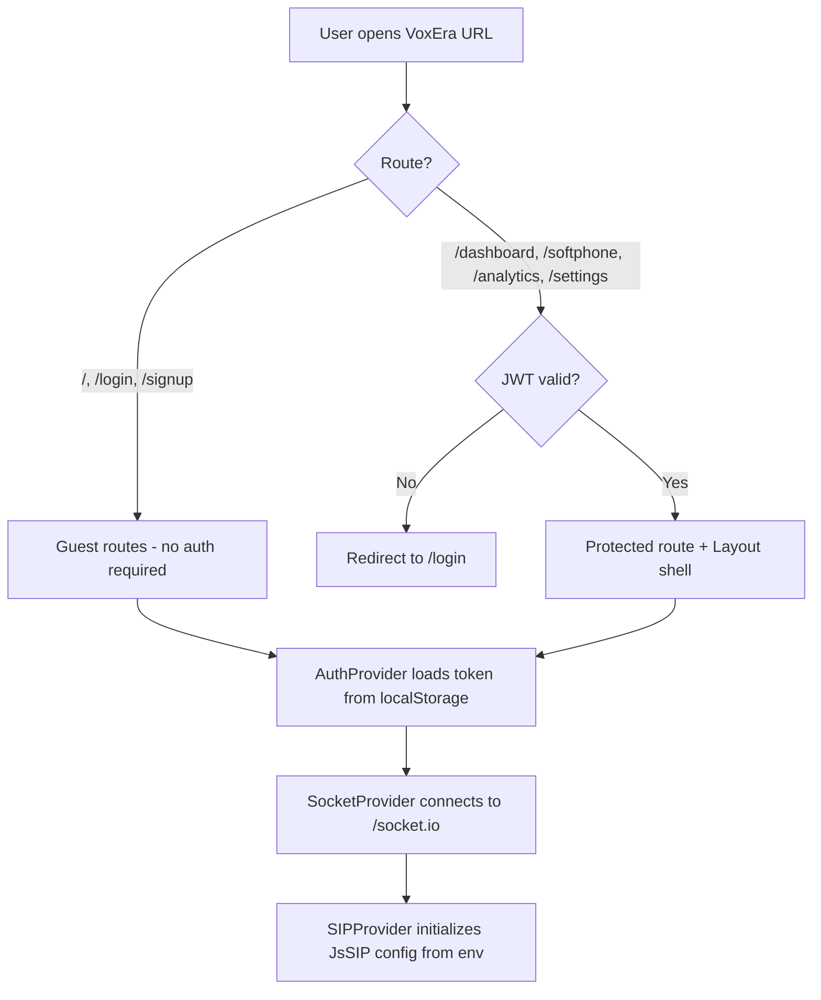
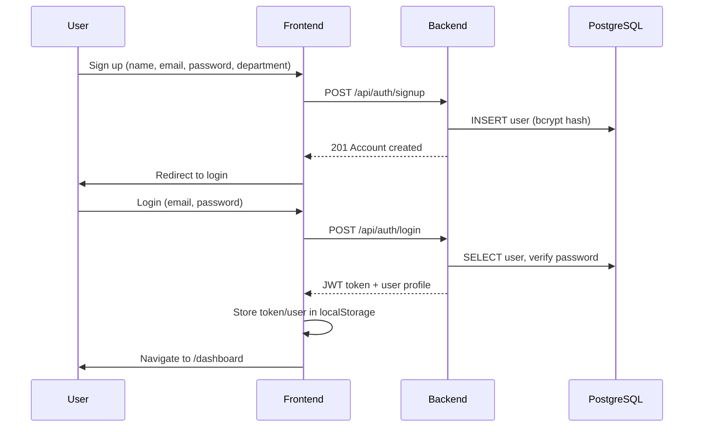
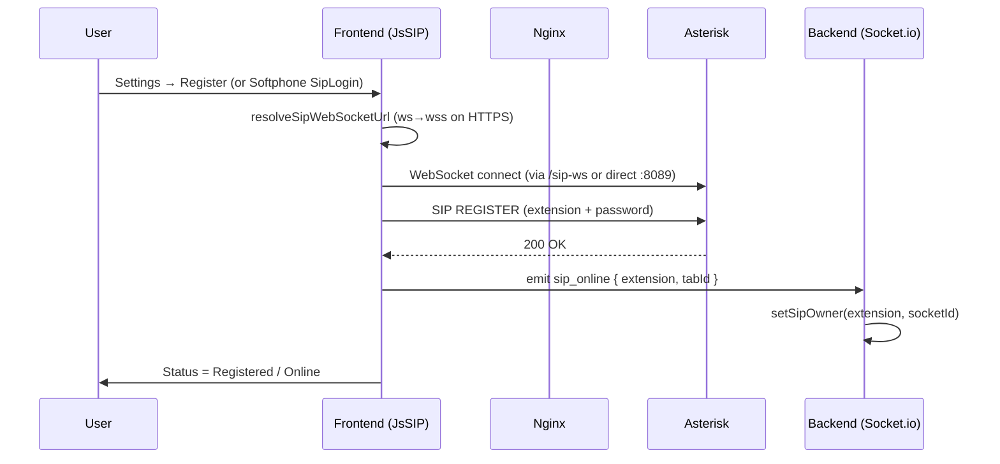
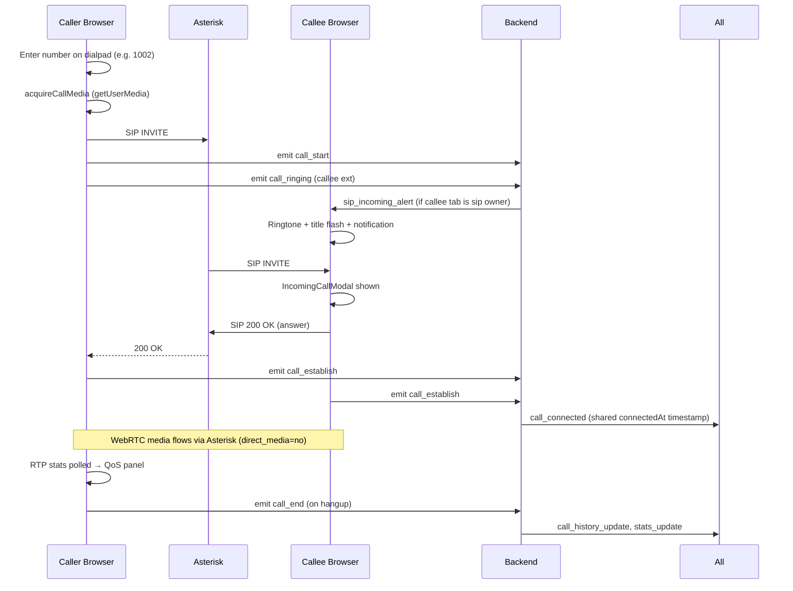
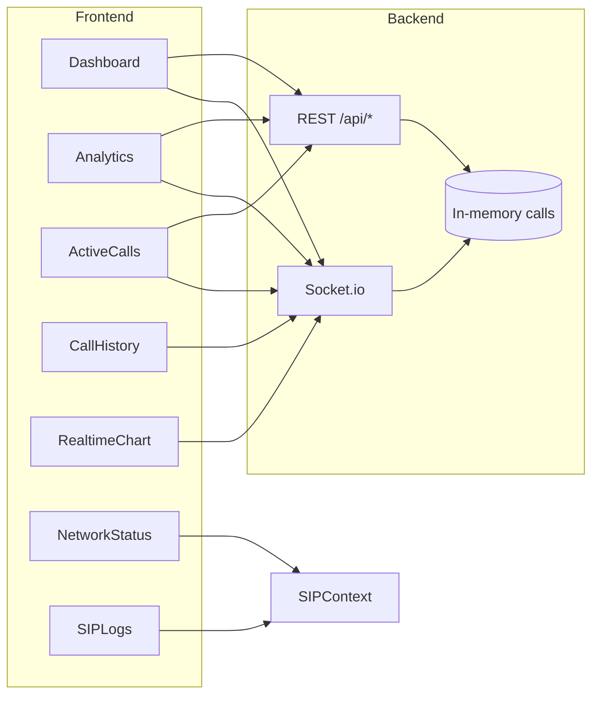

# VoxEra — Version 1.0 Documentation

**VoxEra** is a browser-based SIP softphone and real-time call monitoring dashboard. Version 1 delivers user authentication, WebRTC voice calling through Asterisk, live call analytics, QoS monitoring, and AWS EC2 deployment via Docker Hub and GitHub Actions.

---

## Table of Contents

1. [System Overview](#1-system-overview)
2. [Tech Stack](#2-tech-stack)
3. [Architecture](#3-architecture)
4. [Web Application Workflow](#4-web-application-workflow)
5. [Functionality Reference](#5-functionality-reference)
6. [Backend API](#6-backend-api)
7. [Socket.io Events](#7-socketio-events)
8. [SIP & Asterisk](#8-sip--asterisk)
9. [Environment Variables](#9-environment-variables)
10. [Deployment](#10-deployment)
11. [Limitations (V1)](#11-limitations-v1)
12. [Project Structure](#12-project-structure)

---

## 1. System Overview

VoxEra is a full-stack VoIP web application consisting of four Docker services:

| Service    | Role |
|-----------|------|
| **Frontend** | React SPA served by Nginx (HTTPS, SPA routing, API/Socket/SIP proxy) |
| **Backend**  | Node.js REST API + Socket.io real-time hub |
| **PostgreSQL** | Persistent storage for users and feedback |
| **Asterisk** | PJSIP PBX for WebRTC SIP registration and call routing |

**Pre-configured SIP extensions:** `1001` and `1002` (password = extension number).

**Target use case:** Enterprise-style internal calling between browser softphones, with a monitoring dashboard for call activity and media quality.

---

## 2. Tech Stack

### Frontend

| Technology | Version | Purpose |
|-----------|---------|---------|
| React | 18.3 | UI framework |
| Vite | 5.x | Build tool and dev server |
| React Router | 6.x | Client-side routing |
| Tailwind CSS | 3.4 | Utility-first styling |
| Framer Motion | 11.x | Page and component animations |
| Recharts | 2.x | Analytics and QoS charts |
| Lucide React | 0.344 | Icons |
| JsSIP | 3.10 | Browser SIP/WebRTC client |
| Socket.io Client | 4.8 | Real-time updates from backend |
| Three.js | 0.184 | 3D/visual effects (landing) |

### Backend

| Technology | Version | Purpose |
|-----------|---------|---------|
| Node.js | 20 | Runtime |
| Express | 5.x | REST API |
| Socket.io | 4.8 | WebSocket event bus |
| jsonwebtoken | 9.x | JWT authentication |
| bcryptjs | 3.x | Password hashing |
| pg (node-postgres) | 8.x | PostgreSQL client |

### Infrastructure & Telephony

| Technology | Purpose |
|-----------|---------|
| PostgreSQL 16 | User accounts, feedback |
| Asterisk (PJSIP) | SIP registrar, dialplan, WebRTC media |
| Nginx | Reverse proxy, TLS termination, SIP WebSocket proxy |
| Docker & Docker Compose | Container orchestration |
| GitHub Actions | CI/CD pipeline |
| Docker Hub | Container image registry |
| AWS EC2 | Production hosting |

### WebRTC / Media

- **Codecs:** Opus (preferred), ulaw, alaw
- **ICE:** Google STUN servers (`stun.l.google.com`)
- **Encryption:** DTLS-SRTP (WebRTC endpoints)
- **Audio:** `getUserMedia` for mic; hidden `<audio id="remoteAudio">` for playback

---

## 3. Architecture

```
┌─────────────────────────────────────────────────────────────────────────┐
│                         Browser (User)                                   │
│  React SPA ── JsSIP (SIP/WebRTC) ── Web Audio (ringtones)               │
└────────────┬──────────────────────────────┬─────────────────────────────┘
             │ HTTPS :443                   │ WSS /sip-ws (via nginx)
             │ /api, /socket.io             │
             ▼                              ▼
┌────────────────────────┐      ┌──────────────────────────┐
│  Nginx (frontend)      │      │  Asterisk (PJSIP)        │
│  - SPA static files    │      │  - SIP REGISTER          │
│  - /api → backend      │      │  - Dialplan _10XX        │
│  - /socket.io → backend│      │  - RTP :10000-10099      │
│  - /sip-ws → asterisk  │      │  - WebSocket :8089       │
└───────────┬────────────┘      └──────────────────────────┘
            │
            ▼
┌────────────────────────┐      ┌──────────────────────────┐
│  Backend (Node.js)     │◄────►│  PostgreSQL              │
│  - REST /api/*         │      │  - users                 │
│  - Socket.io hub       │      │  - feedbacks             │
│  - In-memory calls     │      └──────────────────────────┘
└────────────────────────┘
```

### Data persistence (V1)

| Data | Storage |
|------|---------|
| User accounts | PostgreSQL (`users` table) |
| Feedback | PostgreSQL (`feedbacks` table) |
| Call history | **In-memory** (backend, max 200 records; lost on restart) |
| Active calls | **In-memory** (backend) |
| SIP contacts | Asterisk memory (`contact=memory` in sorcery) |
| SIP credentials / settings | `localStorage` + build-time `VITE_*` env vars |
| Auth session | `localStorage` (`token`, `user`) |

---

## 4. Web Application Workflow

### 4.1 Application bootstrap



On load, the app wraps all routes in three providers (order matters):

1. **AuthProvider** — restores JWT from `localStorage`, verifies via `GET /api/auth/me`
2. **SocketProvider** — connects to backend Socket.io (`/socket.io`)
3. **SIPProvider** — holds SIP registration state, call state, RTP metrics, SIP logs

Global components always mounted: `IncomingCallModal`, `CallAlerts`, hidden `remoteAudio` element.

---

### 4.2 User registration & login workflow



**Notes:**
- Signup does **not** auto-login; user must sign in separately.
- JWT expires after **24 hours**.
- Password minimum length: **6 characters**.
- App users are **not** linked to SIP extensions automatically.

---

### 4.3 SIP registration workflow



**SIP configuration sources (priority):**
1. Build-time env: `VITE_SIP_WS_URL`, `VITE_SIP_URI`, `VITE_SIP_PASSWORD`
2. Settings page overrides (saved to `localStorage` as `voipsight_settings`)
3. Extension-as-password convention: extension `1001` → password `1001`

**One tab per extension:** Asterisk `max_contacts=1`. If two browser tabs register the same extension, the last tab wins; the previous tab receives `sip_owner_lost`.

---

### 4.4 Outbound call workflow



**Dialplan:** Extensions matching `_10XX` (1000–1099) dial `PJSIP/${EXTEN}@${EXTEN}` with 30s timeout.

---

### 4.5 In-call controls workflow

| Action | JsSIP method | UI location |
|--------|-------------|-------------|
| Mute | `session.mute()` / `unmute()` | Softphone CallControls |
| Hold | `session.hold()` / `unhold()` | Softphone CallControls |
| Hangup | `session.terminate()` | Softphone, IncomingCallModal (reject) |
| DTMF | Dialpad during call | DialPad component |
| Answer | `session.answer()` | IncomingCallModal |

Call timer syncs across parties via backend `call_connected` event (`connectedAt` timestamp).

---

### 4.6 Dashboard & analytics data flow



**RealtimeChart** plots call/bandwidth metrics from Socket.io `stats_update` and local SIP RTP data.

**SIPLogs** are client-side only (last 100 entries from JsSIP events in `SIPContext`).

---

### 4.7 Landing page workflow (public)

- No authentication required.
- Features showcase, privacy/terms modals.
- **Feedback form:** `POST /api/feedback` + live feed via Socket.io (`feedback_init`, `new_feedback`).
- Links to Login / Signup.

---

### 4.8 Production request path

```
Browser → https://EC2_IP/
         → Nginx :443 (TLS)
         → /           → React SPA
         → /api/*      → backend:5000
         → /socket.io  → backend:5000 (WebSocket upgrade)
         → /sip-ws     → asterisk:8089/ws (SIP WebSocket proxy)

Browser → Asterisk directly (alternative):
         → ws://EC2_IP:8089/ws (dev / non-HTTPS)
         → UDP 5060 (SIP signaling)
         → UDP 10000-10099 (RTP media)
```

HTTP (:80) redirects to HTTPS (:443) in production nginx config.

---

## 5. Functionality Reference

### 5.1 Pages

| Page | Route | Auth | Description |
|------|-------|------|-------------|
| Landing | `/` | Guest | Marketing page, feedback widget, legal modals |
| Login | `/login` | Guest | Email/password login, remember-me |
| Signup | `/signup` | Guest | Account creation (name, email, password, department) |
| Dashboard | `/dashboard` | Protected | Overview stats, active calls, charts, SIP logs, network status |
| Softphone | `/softphone` | Protected | Dialpad, call controls, QoS panel, SIP login when offline |
| Analytics | `/analytics` | Protected | Call distribution, top callers, call history, realtime chart |
| Settings | `/settings` | Protected | Profile display, SIP config, register/unregister, logout |

### 5.2 Authentication

- JWT bearer token authentication
- Protected routes via `ProtectedRoute` (redirects to `/login`)
- Guest routes via `GuestRoute` (redirects authenticated users away from login/signup)
- Token verification on app load via `/api/auth/me`
- Logout clears `localStorage` token and user

### 5.3 Softphone

- **SIP registration** via Settings or inline `SipLogin` on Softphone page
- **Dialpad** with number input and DTMF
- **Outbound calls** to `_10XX` extensions
- **Inbound calls** via `IncomingCallModal` (answer/reject)
- **Call controls:** mute, hold, hangup
- **Call timer** with cross-tab sync via backend
- **Call quality panel:** jitter, RTT, packet loss, bitrate, codec, ICE type, quality score, live graphs
- **Disabled states:** dialpad/call button disabled when not registered

### 5.4 Call alerts & notifications

- US-style incoming ringtone (Web Audio API, no asset files)
- Outbound ringback tone while waiting for answer
- Document title flash during incoming calls
- Browser `Notification` API (permission requested on register)
- Audio unlock on first user gesture (Chrome autoplay policy)
- Socket.io `sip_incoming_alert` for cross-tab ring when callee is on another page

### 5.5 Monitoring (Dashboard)

- **Stat cards:** total calls, current call duration, SIP online/offline, success rate
- **ActiveCalls:** live list from `/api/active-calls` + `active_calls_update`
- **NetworkStatus:** RTT, jitter, packet loss, packets sent/received, SIP status
- **SIPLogs:** scrollable protocol-level log (register, invite, bye, errors)
- **RealtimeChart:** live bandwidth/call activity chart

### 5.6 Analytics (Reports)

- Call distribution (completed, missed, failed, in progress)
- Top 5 callers by volume
- Full **CallHistory** table with direction, status, duration, timestamp
- Realtime chart

### 5.7 Settings

- **Profile:** read-only display of name, email, department from auth context
- **SIP Configuration:** WebSocket URL, SIP URI, password; Register/Unregister buttons; connection status
- **Notifications / Security toggles:** UI only (not wired to backend in V1)
- Save preferences to `localStorage` (`voipsight_settings`)
- Logout

### 5.8 Feedback (Landing)

- Star rating (1–5), name, message (max 500 chars)
- Persisted in PostgreSQL
- Real-time feed on landing page (last 20 via socket)

### 5.9 User directory

- `GET /api/users/directory` — lists registered app users (name, email, department, status)
- Not integrated into softphone contact list in V1

### 5.10 QoS / WebRTC stats

**Metrics calculated** (`statsParser.js` + `useWebRTCStats` hook):

| Metric | Source |
|--------|--------|
| Jitter | `inbound-rtp` report |
| RTT | `remote-inbound-rtp` or `candidate-pair` |
| Packet loss | `packetsLost / (packetsReceived + packetsLost)` |
| Bitrate | Delta `bytesReceived` over poll interval |
| Codec | `inbound-rtp` → codec report |
| ICE type | `host` / `srflx` / `relay` |
| Quality score | 100 minus deductions for jitter, RTT, packet loss thresholds |

Poll interval: **1 second** during active calls. History: last **60** data points.

### 5.11 UI / Design system

- Dark theme (`#081120` background)
- Purple-blue gradient accents (`#5B2EFF` → `#00A6FF`)
- Glassmorphism cards (`GlassCard`)
- Responsive layout with collapsible sidebar
- Framer Motion page transitions
- `ErrorBoundary` for React error containment

---

## 6. Backend API

| Method | Endpoint | Auth | Description |
|--------|----------|------|-------------|
| POST | `/api/auth/signup` | No | Create user account |
| POST | `/api/auth/login` | No | Login, returns JWT |
| GET | `/api/auth/me` | Bearer JWT | Verify token, return user |
| GET | `/api/users/directory` | No | List app users |
| GET | `/api/users/extensions` | No | Redirect to `/api/users/directory` |
| POST | `/api/feedback` | No | Submit feedback |
| GET | `/api/feedback` | No | List feedback (limit 100) |
| GET | `/api/calls` | No | Call history (in-memory) |
| GET | `/api/active-calls` | No | Active calls (in-memory) |
| POST | `/api/calls` | No | Manually append call record |
| GET | `/api/health` | No | Service health + DB status |
| GET | `/api/stats` | No | Aggregated stats (users, feedback, calls) |

---

## 7. Socket.io Events

### Server → Client

| Event | Payload | When |
|-------|---------|------|
| `feedback_init` | Feedback[] | On connect |
| `new_feedback` | Feedback | New submission |
| `active_calls_update` | Call[] | Call state change / 1s tick |
| `call_history_update` | Call[] | Call ended |
| `call_connected` | `{ id, connectedAt }` | First party establishes |
| `call_end_broadcast` | `{ id, caller, callee }` | Call ended |
| `stats_update` | `{ totalCalls, completedCalls }` | Call history changes |
| `sip_incoming_alert` | `{ id, caller, callee }` | Outbound ring to callee tab |
| `sip_owner_lost` | `{ extension, tabId }` | Another tab took extension |

### Client → Server

| Event | Payload | When |
|-------|---------|------|
| `sip_online` | `{ extension, tabId }` | SIP registered |
| `sip_offline` | — | SIP unregistered / disconnect |
| `call_ringing` | `{ id, caller, callee }` | Outbound ring |
| `call_start` | Call object | Call initiated |
| `call_establish` | Call object | Call answered |
| `call_end` | `{ id, status, duration }` | Call terminated |

---

## 8. SIP & Asterisk

### Extensions (generated at container start)

| Extension | Password | max_contacts |
|-----------|----------|--------------|
| 1001 | 1001 | 1 |
| 1002 | 1002 | 1 |

### PJSIP configuration

Split across multiple files to avoid INI merge bugs:
- `pjsip.aor.conf`, `pjsip.endpoint.conf`, `pjsip.auth.conf`, `pjsip.transport.conf`, `pjsip.global.conf`
- `sorcery.conf` — `contact=memory` (contacts not in astdb)
- WebRTC-enabled endpoints: DTLS, ICE, `direct_media=no`, Opus/ulaw/alaw

### Ports (production EC2 security group)

| Port | Protocol | Purpose |
|------|----------|---------|
| 22 | TCP | SSH |
| 80 | TCP | HTTP → HTTPS redirect |
| 443 | TCP | Frontend HTTPS |
| 8089 | TCP | Asterisk WebSocket (direct access) |
| 5060 | UDP | SIP signaling |
| 10000–10099 | UDP | RTP media (~50 concurrent calls) |

### Dialplan

```
exten => _10XX,1,Dial(PJSIP/${EXTEN}@${EXTEN},30,r)
```

---

## 9. Environment Variables

See `.env.example` for the full template.

### Frontend (Vite — baked at build time)

| Variable | Description |
|----------|-------------|
| `VITE_API_URL` | Backend URL; empty = same-origin (`/api`) |
| `VITE_SIP_WS_URL` | SIP WebSocket, e.g. `ws://IP:8089/ws` |
| `VITE_SIP_URI` | Default SIP URI, e.g. `sip:1001@IP` |
| `VITE_SIP_PASSWORD` | Default SIP password |

### Backend

| Variable | Description |
|----------|-------------|
| `PORT` | API port (default 5000) |
| `JWT_SECRET` | **Required** — JWT signing key |
| `DATABASE_URL` | **Required** — PostgreSQL connection string |
| `PUBLIC_HOST` | Public hostname/IP |
| `ASTERISK_HOST` | Asterisk hostname (Docker: `asterisk`) |
| `ASTERISK_PORT` | Asterisk HTTP/WS port (8089) |

### Shared / Docker

| Variable | Description |
|----------|-------------|
| `POSTGRES_DB`, `POSTGRES_USER`, `POSTGRES_PASSWORD` | Database credentials |
| `ASTERISK_EXTERNAL_IP` | Public IP for SIP realm and RTP |
| `DOCKER_USERNAME`, `DOCKERHUB_TOKEN` | CI/CD image push |

---

## 10. Deployment

### Local development

```bash
cp .env.example .env.local
docker compose --env-file .env.local up --build
```

Or run frontend and backend separately:
```bash
# Terminal 1
cd backend && npm install && node server.js

# Terminal 2
npm install && npm run dev
```

### Production (AWS EC2)

1. Provision Ubuntu EC2 + Elastic IP + security group
2. Bootstrap: `sudo bash scripts/bootstrap-ec2.sh`
3. Configure GitHub Secrets (see `DEVOPS.md`)
4. `git push origin main` → CI builds, pushes to Docker Hub, SSH deploys

**Pipeline jobs:** Build & Test → Docker Build & Push → Deploy to EC2

Full details: **[DEVOPS.md](DEVOPS.md)**

---

## 11. Limitations (V1)

### Telephony & calling

| Limitation | Detail |
|-----------|--------|
| **Audio only** | No video calling |
| **Two hardcoded extensions** | Only 1001 and 1002; no admin UI to add extensions |
| **No call transfer** | Cannot blind or attended transfer |
| **No conference** | No multi-party calls |
| **No voicemail** | No message storage or retrieval |
| **No call recording** | Calls are not recorded or stored |
| **Extension ≠ app user** | Signing up does not create a SIP extension |
| **One contact per extension** | Second tab kicks the first (`max_contacts=1`) |
| **Internal extensions only** | Dialplan `_10XX`; no PSTN/trunk integration |
| **No TURN server** | Only Google STUN; NAT-restricted networks may fail media |
| **HTTP dev mic blocked** | Microphone requires HTTPS on public IPs |

### Data & persistence

| Limitation | Detail |
|-----------|--------|
| **Call history in memory** | Lost on backend restart (max 200 records) |
| **Active calls in memory** | Not persisted |
| **No per-user call history** | All users share one global call log |
| **SIP logs client-side only** | Not sent to backend; cleared on refresh |

### Security & auth

| Limitation | Detail |
|-----------|--------|
| **No HTTPS in dev compose** | Production nginx uses self-signed cert |
| **No 2FA** | Toggle exists in Settings UI but is not implemented |
| **No role-based access** | All authenticated users have same access |
| **API mostly unauthenticated** | Call/feedback/directory endpoints have no JWT guard |
| **SIP passwords in env/localStorage** | Not vault-managed |
| **JWT in localStorage** | Vulnerable to XSS (standard SPA tradeoff) |
| **ws:// in production** | Direct SIP WS is unencrypted; use nginx `/sip-ws` WSS proxy |

### UI / features

| Limitation | Detail |
|-----------|--------|
| **Settings toggles decorative** | Notifications and security toggles don't change behavior |
| **Profile not editable** | Settings shows read-only profile |
| **No contact directory in softphone** | User directory API exists but isn't used for dialing |
| **No PWA / desktop app** | Browser-only |
| **No multi-language** | English only |
| **Sidebar quick stats static** | Active Calls / History / Users counts show 0 |

### Operations

| Limitation | Detail |
|-----------|--------|
| **~50 concurrent calls** | RTP port range 10000–10099 (100 UDP ports) |
| **Single EC2 instance** | No horizontal scaling or load balancing |
| **Asterisk config rebuild** | Config changes require `docker compose build --no-cache asterisk` |
| **No monitoring/alerting** | No Prometheus, Grafana, or uptime alerts |
| **No automated backups** | PostgreSQL volume not backed up by default |

### Planned but not in V1 (from README)

- Video calling, call recording, conference calls, contact directory, call transfer, voicemail, advanced reports, multi-language, PWA, desktop notifications (beyond basic Web Notifications API)

---

## 12. Project Structure

```
VoxEra/
├── src/                          # React frontend
│   ├── components/
│   │   ├── Analytics/            # RealtimeChart, CallHistory
│   │   ├── Layout/               # Layout, Navbar, Sidebar
│   │   ├── Monitoring/           # ActiveCalls, NetworkStatus, RTPMetrics, SIPLogs
│   │   ├── QoS/                  # CallQualityPanel, QoS cards/graphs
│   │   ├── Softphone/            # DialPad, CallControls, SipLogin, IncomingCallModal
│   │   └── UI/                   # GlassCard
│   ├── context/                  # AuthContext, SocketContext, SIPContext
│   ├── hooks/                    # useSip, useWebRTCStats
│   ├── pages/                    # Landing, Login, Signup, Dashboard, Softphone, Analytics, Settings
│   ├── services/                 # sipService.js (JsSIP layer)
│   ├── utils/                    # callAlerts.js, statsParser.js
│   └── config/                   # env.js
├── backend/
│   ├── server.js                 # Express + Socket.io
│   └── db.js                     # PostgreSQL schema & queries
├── asterisk/                     # PJSIP configs, Dockerfile, entrypoint
├── nginx/                        # Production reverse proxy config
├── scripts/                      # EC2 deploy, Asterisk debug scripts
├── .github/workflows/ci-cd.yml   # CI/CD pipeline
├── docker-compose.yml            # Full stack compose
├── Dockerfile                    # Frontend image
├── DEVOPS.md                     # AWS deployment guide
└── DOCUMENTATION_V1.md           # This file
```

---

## Version

| Field | Value |
|-------|-------|
| **Product** | VoxEra |
| **Version** | 1.0.0 |
| **Package name** | `voxera` |
| **Status** | Feature-complete for V1 scope |

---

© 2026 VoxEra. All rights reserved.
